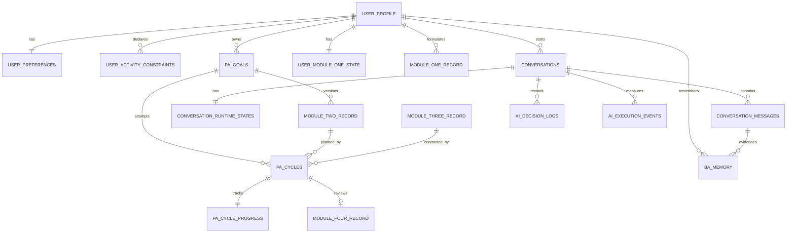

# BA Coach 数据库 V2 目标设计稿

> 2026-09-11 更新：V2 核心模型已切换生产，后端和网页已适配。当前字段及能力边界以 DATABASE.md、DATABASE_LIVE_V2_20260910.md 和上线报告为准。下方“尚未迁移”为历史设计阶段描述。

版本：2026-09-08（模块一字段语义澄清，保留字段结构）

状态：讨论稿，尚未执行数据库迁移

依据：`数据库字段20260826.docx`、当前项目数据库结构与现有工作流实现

> 本文描述的是建议采用的目标结构，不代表当前线上数据库已经具备这些字段。
> 当前线上结构仍以 `DATABASE.md` 为准；现有 7 张外部业务表仍遵守“应用不自行执行 DDL”的约束。

> 2026-09-10 核实：库名已是 `ba_coach_260908`，不代表 V2 已上线。`pa_goals`、`user_module_one_state`、`pa_cycle_progress`、`ba_memory`、`ai_decision_logs` 均未在生产库发现。当前完整字段见 `DATABASE_LIVE_SCHEMA_20260910.md`。以下目标生命周期已消除文内矛盾，但仍是待实现的目标合同；不要据此直接对生产库执行 ALTER。

---

## 一、本版做了哪些调整

本版保留了原方案按用户、流程、记忆、模块记录、目标周期、聊天和日志分层的整体方向，主要修正了以下问题。

| 调整主题 | 原方案 | V2 调整 | 调整原因 |
|---|---|---|---|
| 聊天与目标关系 | 新建聊天时自动放弃旧 `active` 周期 | 新建聊天不改变目标状态；只有用户明确结束、替换或放弃时才改变 | 新建窗口不等于放弃目标，避免产生错误的放弃率 |
| 目标与执行关系 | 一个 `target_cycle` 只能关联一条模块四记录 | 拆成“长期目标 `pa_goals`”与“单次执行周期 `pa_cycles`”；一个目标可有多次执行和复盘 | 能准确保存同一目标多次尝试的历史 |
| 目标修改 | 模块二记录原地覆盖 | 模块二按版本追加；周期引用执行当时的目标版本 | 防止修改计划后重写旧执行记录的含义 |
| 模块进度 | 所有步骤永久追加，跨周期复用 | 模块一保留用户级完成状态；模块二至四按执行周期保存并在新周期重新开始 | 避免第二轮目标误用第一轮的完成步骤 |
| 模块一模式与事件 | 典型情境、应对字段与事件 JSON 的记录范围未明确区分 | 保留字段；将典型模式摘要与具体事件快照分开定义，明确来源和冲突处理 | 保留完整事件供理解与追溯，避免把一次事件当作长期规律或将不同事件拼接 |
| 流程结束 | `current_module` 中混入 `completed`，其他章节又只允许四个模块 | `current_module` 只保存四个模块；另设 `flow_status` 表示活跃、等待执行、暂停或结束 | 将“在哪个模块”和“流程是否继续”分开 |
| 模块二意向 | `module_2_has_intention` 只写一次 | 意向判断属于目标或周期，可在新目标中重新评估 | 用户意向会变化，不能永久固定 |
| 长期记忆 | 同类记忆多条，但只取最新一条 | 每条记忆有独立 `memory_key`、来源、确认状态和替代关系；检索所有有效项 | 同类记忆可以同时成立，不能互相覆盖 |
| AI 评分 | AI 对理解或认可打 0–5 分 | 流程判断使用可解释的确认状态；如需评分，保留 0–2 旧口径并标记评分来源 | 没有量表定义的 0–5 分难以复现和比较 |
| 模块四写入 | 对话中逐步写入，但多个未知字段同时要求非空 | 增加 `record_status=draft/confirmed`；草稿允许未知，确认时按场景校验 | 避免 AI 为通过数据库约束而编造信息 |
| 执行结果编码 | 新文档重新定义为 0–3 | 保留现有 1–4：成功、未执行、受阻、部分完成 | 避免旧数据含义被静默改变 |
| 复盘决策编码 | 新文档重新定义为 0–3 | 保留现有 1–3，并新增 4=结束目标 | 与现有数据兼容，同时覆盖“用户不准备继续” |
| 会话标识 | `conversation_id` 同时表示整数主键和字符串会话 ID | 内部关联统一使用 `conversations.id`；对外字符串统一命名 `session_id` | 避免错误 join 和外键类型不一致 |
| 用户限制 | 身体限制、明确边界和普通偏好混在一个 `SET` | 拆成可追加、可失效、有来源的 `user_activity_constraints` | 三类信息的强度和处理方式不同，也会随时间变化 |
| JSON 字段 | 只声明 JSON，内部结构靠文字约定 | 文档定义结构版本和必需属性；应用校验，条件允许时增加数据库检查 | JSON 类型只能保证格式，不能自动保证业务字段齐全 |
| AI 日志 | 业务决策、模型耗时与原始推理混在一起 | 业务决策日志与模型执行遥测分开；不保存原始思维链 | 提高可审计性，同时减少敏感信息和无用日志 |
| 现有能力 | 新方案未覆盖风险、知识库、同步等现有表 | 明确保留账号、风险监测、互动状态、知识库、消息修订号和执行遥测 | 防止“按新文档重建”时意外删除现有能力 |

### 本版采用的核心定义

1. **一段聊天**是用户与系统的一段对话历史，不决定目标是否结束。
2. **一个 PA 目标**是用户一段时间内希望持续尝试的行为目标。
3. **一个目标版本**是该目标某次确认后的具体计划；调整时间、时长或难度会产生新版本。
4. **一个执行周期**是基于某个目标版本的一次计划、执行、反馈和复盘。
5. **一条模块四记录**属于一个执行周期；同一长期目标可以有多条模块四记录。
6. **未知值保持 NULL**，不能用 0、空字符串或空 JSON 代替，也不能由 AI 补造。

---

## 二、业务流程和数据关系



### 推荐流程

```text
首次建立问题理解（模块一，可跨目标复用）
        ↓
进入模块二：创建草稿目标及 planning 周期，先有周期再保存步骤
        ↓
讨论并确认目标版本：绑定本周期的确认版本（不另建周期）
        ↓
达成记录契约（模块三）
        ↓
等待用户执行
        ↓
读取已有执行周期并复盘（模块四不补建历史周期）
        ↓
继续原版本 / 调整为新版本 / 更换目标 / 结束目标
```

新开聊天后，系统读取用户当前目标和未完成周期，但不自动改变它们。用户可以在新聊天中继续同一目标，也可以明确要求开始新目标。

已确定的产品规则：允许同一用户多个进行中目标；每段聊天必须明确选择一个目标。已完成且已确认 M1 的用户，新聊天复用该版本，从目标选择／设定继续。以上为用户已确认需求，当前旧运行时尚未实现完整目标选择及 M1 版本复用，不能再标为“尚未决策”。

---

## 三、统一字段约定

### 3.1 标识符

| 对象 | 字段 | 类型 | 规则 |
|---|---|---|---|
| 用户 | `user_profile.uuid` | `CHAR(36)` | UUID，所有用户级业务数据的统一逻辑标识 |
| 对话内部主键 | `conversations.id` | `BIGINT` | 数据库自增，仅用于数据库关联 |
| 对外会话 ID | `conversations.session_id` | `VARCHAR(64)` | 后端生成、唯一、不可由客户端决定归属 |
| 目标 | `pa_goals.id` | `CHAR(36)` | UUID v4，由应用层生成 |
| 执行周期 | `pa_cycles.id` | `CHAR(36)` | UUID v4，由应用层生成 |
| 模块记录 | 各表 `id` | `CHAR(36)` | UUID v4；旧表若保留原类型，由迁移层映射 |

所有引用用户 UUID 的字段应使用相同字符集和排序规则。客户端产生的请求 ID 可以用于幂等，但不能代替后端鉴权后的用户身份。

### 3.2 通用时间与版本字段

- 所有时间保存为 UTC `DATETIME(6)`，展示时按用户时区转换。
- 可修改记录包含 `created_at`、`updated_at`。
- 需要并发更新的运行态包含 `row_version`，每次更新加 1。
- 业务历史原则上追加版本，不通过覆盖来修改已经被周期引用的事实。

### 3.3 缺失值

| 表达 | 存储方式 |
|---|---|
| 尚未询问或无法判断 | `NULL` |
| 用户明确回答“没有” | 对应布尔值 `0`，必要时保存原话 |
| 用户拒绝回答 | 状态字段记录 `declined`，正文保持 `NULL` |
| 不适用于当前场景 | 状态字段记录 `not_applicable` |
| 空列表确实是用户确认结果 | `[]` |

---

## 四、L1：账号、用户档案与偏好

账号、会话令牌、邮箱、角色等继续沿用现有应用自有表：`user_accounts`、`account_handles`、`account_settings`、`account_emails`、`account_email_tokens`、`auth_sessions`。本节只列需要调整的业务资料表。

### 4.1 `user_profile` — 用户基本档案

| 字段 | 类型 | 空 | 默认 | 说明 |
|---|---|:-:|---|---|
| `uuid` | `CHAR(36)` | 否 | — | 主键，用户统一业务 ID |
| `nickname` | `VARCHAR(64)` | 是 | `NULL` | 用户希望被称呼的名字；未填写时使用账号展示名 |
| `birth_year` | `SMALLINT` | 是 | `NULL` | 可选；比持续过期的固定年龄更稳定 |
| `gender` | `VARCHAR(32)` | 是 | `NULL` | 可选，允许“不愿透露”和自定义，不作为流程必填条件 |
| `occupation_status` | `VARCHAR(32)` | 是 | `NULL` | 学生、全职、兼职、未就业、退休、其他 |
| `living_status` | `VARCHAR(32)` | 是 | `NULL` | 独居、与家人、与伴侣、合住、其他 |
| `timezone` | `VARCHAR(64)` | 否 | `Asia/Shanghai` | IANA 时区，用于目标时间和提醒换算 |
| `module1_done_flag` | `TINYINT(1)` | 否 | `0` | 用户是否至少完成过一次模块一，只能从 0 变为 1 |
| `created_at` | `DATETIME(6)` | 否 | `CURRENT_TIMESTAMP(6)` | 创建时间 |
| `updated_at` | `DATETIME(6)` | 否 | `CURRENT_TIMESTAMP(6)` | 最后更新时间 |

约束与索引：

- 主键：`uuid`。
- `birth_year` 只做合理范围校验，不从缺失值推断年龄。
- `module1_done_flag` 只表达“曾完成过”，不表达当前模块。

### 4.2 `user_preferences` — 对话和活动偏好

| 字段 | 类型 | 空 | 默认 | 说明 |
|---|---|:-:|---|---|
| `user_id` | `CHAR(36)` | 否 | — | 主键，逻辑关联 `user_profile.uuid` |
| `communication_style` | `VARCHAR(32)` | 是 | `NULL` | 温和支持、直接务实、启发提问或自定义 |
| `response_verbosity` | `VARCHAR(16)` | 是 | `NULL` | 简洁、适中、详细 |
| `activity_environment` | `VARCHAR(16)` | 是 | `NULL` | 室内、室外、均可 |
| `activity_social` | `VARCHAR(16)` | 是 | `NULL` | 独处、一对一、小组、均可 |
| `activity_atmosphere` | `VARCHAR(16)` | 是 | `NULL` | 安静、热闹、均可；由原 `activity_intensity` 改名 |
| `preferred_activity_intensity` | `VARCHAR(16)` | 是 | `NULL` | 低、中、高、均可；与环境氛围分开 |
| `updated_at` | `DATETIME(6)` | 否 | `CURRENT_TIMESTAMP(6)` | 最后更新时间 |

这里都是软偏好。AI 可以用于排序建议，但不能把它们当作永久禁令。

### 4.3 `user_activity_constraints` — 活动限制、边界与偏好条目

| 字段 | 类型 | 空 | 默认 | 说明 |
|---|---|:-:|---|---|
| `id` | `CHAR(36)` | 否 | — | 主键 |
| `user_id` | `CHAR(36)` | 否 | — | 用户 UUID |
| `constraint_type` | `VARCHAR(24)` | 否 | — | `safety_limit`、`user_boundary`、`preference` |
| `category` | `VARCHAR(32)` | 否 | — | 身体、环境、社交、交通、内容等 |
| `content` | `TEXT` | 否 | — | 用户原意的简洁描述 |
| `source_type` | `VARCHAR(24)` | 否 | `user_stated` | `user_stated`、`profile_form`、`ai_inferred` |
| `source_message_id` | `BIGINT` | 是 | `NULL` | 来源消息；表单来源可为空 |
| `confirmation_status` | `VARCHAR(24)` | 否 | `unconfirmed` | `unconfirmed`、`confirmed`、`rejected` |
| `status` | `VARCHAR(16)` | 否 | `active` | `active`、`superseded`、`inactive` |
| `supersedes_id` | `CHAR(36)` | 是 | `NULL` | 本条修正了哪条旧记录 |
| `created_at` | `DATETIME(6)` | 否 | `CURRENT_TIMESTAMP(6)` | 创建时间 |
| `updated_at` | `DATETIME(6)` | 否 | `CURRENT_TIMESTAMP(6)` | 更新时间 |

读取时仅把用户确认且仍有效的 `safety_limit` 和 `user_boundary` 当作硬约束；AI 推测不能直接升级为硬约束。

索引：`(user_id, status, constraint_type)`、`source_message_id`。

---

## 五、L2：聊天运行态与模块进度

### 5.1 `conversation_runtime_states` — 每段聊天的权威运行态

| 字段 | 类型 | 空 | 默认 | 说明 |
|---|---|:-:|---|---|
| `conversation_id` | `BIGINT` | 否 | — | 主键，外键到 `conversations.id` |
| `current_module` | `VARCHAR(16)` | 否 | `module_1` | 仅允许 `module_1` 至 `module_4` |
| `flow_status` | `VARCHAR(24)` | 否 | `active` | `active`、`waiting_execution`、`paused`、`completed` |
| `active_goal_id` | `CHAR(36)` | 是 | `NULL` | 当前正在讨论的长期目标 |
| `active_cycle_id` | `CHAR(36)` | 是 | `NULL` | 当前执行周期 |
| `last_transition_reason` | `VARCHAR(255)` | 是 | `NULL` | 最近一次状态变化的简洁、可审计理由 |
| `row_version` | `INT` | 否 | `0` | 乐观锁版本 |
| `updated_at` | `DATETIME(6)` | 否 | `CURRENT_TIMESTAMP(6)` | 最后更新时间 |

规则：

- 这是每段聊天当前模块的唯一权威来源。
- 新建聊天时可以读取用户已有目标，但不会更改旧目标状态。
- `flow_status=waiting_execution` 表示模块三已经完成，正在等待用户实际反馈；它不等于模块四已完成。
- 更新时使用 `row_version` 防止两个设备互相覆盖。

### 5.2 `user_module_one_state` — 可跨目标复用的模块一状态

| 字段 | 类型 | 空 | 默认 | 说明 |
|---|---|:-:|---|---|
| `user_id` | `CHAR(36)` | 否 | — | 主键 |
| `completed_steps` | `JSON` | 否 | `[]` | 已完成的白名单步骤 key |
| `confirmed_formulation_id` | `CHAR(36)` | 是 | `NULL` | 最近一次确认的问题理解版本 |
| `status` | `VARCHAR(16)` | 否 | `in_progress` | `in_progress`、`completed`、`revisit_needed` |
| `completion_source` | `VARCHAR(24)` | 否 | `none` | `none`、`user_confirmed`、`legacy_imported`；完成状态的来源 |
| `evidence_status` | `VARCHAR(24)` | 否 | `missing` | `missing`、`available`；是否具有可追溯的确认版本证据 |
| `updated_at` | `DATETIME(6)` | 否 | `CURRENT_TIMESTAMP(6)` | 更新时间 |

模块一历史可以复用，但当用户描述的核心问题发生明显变化时，创建新的模块一版本并设为 `revisit_needed`，而不是覆盖旧内容。

正式步骤 key 继续沿用现有服务器 key，不另造 M1-T01 等别名：`core_problem_example`、`depression_cycle_formulated`、`ba_education_completed`、`goal_setting_consent`。所有模块的完成规则由 `backend/app/workflow_contract.py` 定义，详见 `DATABASE_CONTRACT_REPAIR_20260910.md`。`revisit_needed` 只是需复核的问题理解状态，不自动触发 Router 回 M1。不得以 `module1_done_flag` 直接虚构一个已确认的 V2 理解版本。

2026-09-10 用户已选择历史迁移第一种方案：旧 `module1_done_flag=1` 导入为 `status=completed`、`completion_source=legacy_imported`、`evidence_status=missing`。允许新聊天复用该完成状态，从目标选择／设定继续，不补问确认、不重做 M1。`confirmed_formulation_id` 保持 NULL，不从“最新 M1 记录”推测确认版本，也不自动补齐步骤证据。新系统产生的正常完成状态使用 `user_confirmed + available`，并关联真实确认版本。这是受控的历史迁移例外，不是模型可以自行赋予新用户的完成依据。

### 5.3 `pa_cycle_progress` — 模块二至四的本周期进度

| 字段 | 类型 | 空 | 默认 | 说明 |
|---|---|:-:|---|---|
| `cycle_id` | `CHAR(36)` | 否 | — | 主键，外键到 `pa_cycles.id` |
| `module_2_steps` | `JSON` | 否 | `[]` | 本周期模块二已完成步骤 |
| `module_3_steps` | `JSON` | 否 | `[]` | 本周期模块三已完成步骤 |
| `module_4_steps` | `JSON` | 否 | `[]` | 本周期模块四已完成步骤 |
| `module_4_scenario` | `VARCHAR(8)` | 是 | `NULL` | `A`、`B`、`C` 或 NULL |
| `row_version` | `INT` | 否 | `0` | 乐观锁版本 |
| `updated_at` | `DATETIME(6)` | 否 | `CURRENT_TIMESTAMP(6)` | 更新时间 |

步骤只在**同一个周期内**单向追加。创建新周期时产生一行新的空进度，不复制上一周期的模块二至四步骤。

---

## 六、L3：长期记忆

### 6.1 `ba_memory` — 有来源、可修正的长期记忆

| 字段 | 类型 | 空 | 默认 | 说明 |
|---|---|:-:|---|---|
| `id` | `CHAR(36)` | 否 | — | 主键 |
| `user_id` | `CHAR(36)` | 否 | — | 用户 UUID |
| `memory_type` | `VARCHAR(32)` | 否 | — | 反刍主题、回避模式、激活敏感点、可用资源、自我评价模式、反复阻碍、有效方法、其他 |
| `memory_key` | `VARCHAR(128)` | 否 | — | 同一事实或模式的稳定逻辑键，不等于类别 |
| `content` | `TEXT` | 否 | — | 当前版本内容 |
| `source_kind` | `VARCHAR(24)` | 否 | — | `user_statement`、`user_confirmation`、`ai_inference`、`imported` |
| `source_message_id` | `BIGINT` | 是 | `NULL` | 主要证据消息 |
| `confirmation_status` | `VARCHAR(24)` | 否 | `unconfirmed` | `unconfirmed`、`confirmed`、`rejected` |
| `confidence_level` | `TINYINT` | 是 | `NULL` | 可选 0–2；仅在有定义的情况下使用 |
| `status` | `VARCHAR(16)` | 否 | `active` | `active`、`superseded`、`rejected`、`expired` |
| `supersedes_id` | `CHAR(36)` | 是 | `NULL` | 本记录修正的旧记录 |
| `valid_from` | `DATETIME(6)` | 是 | `NULL` | 已知有效起点 |
| `valid_until` | `DATETIME(6)` | 是 | `NULL` | 失效时间 |
| `created_at` | `DATETIME(6)` | 否 | `CURRENT_TIMESTAMP(6)` | 创建时间 |
| `updated_at` | `DATETIME(6)` | 否 | `CURRENT_TIMESTAMP(6)` | 更新时间 |

读取规则：

1. 查询该用户所有 `active` 且未过期的相关记忆，而不是每类只取最新一条。
2. `ai_inference + unconfirmed` 只能用试探性表达，不能当作用户事实直接引用。
3. 修正旧记忆时新增一行，并在同一事务中把旧行改为 `superseded`。
4. 同一轮模型重复抽取相同事实不算新的独立确认。
5. 如同步到外部记忆服务，应同步 `memory_key`、状态和替代关系，避免旧错误继续被召回。

索引与约束：

- 索引：`(user_id, status, memory_type)`、`(user_id, memory_key, created_at)`。
- `confidence_level` 只允许 0、1、2 或 NULL。
- `supersedes_id` 不得指向自身。

---

## 七、L4：四个模块的业务记录

### 7.1 `module_one_record` — 问题理解与 BA 解释版本

| 字段 | 类型 | 空 | 默认 | 说明 |
|---|---|:-:|---|---|
| `id` | `CHAR(36)` | 否 | — | 主键 |
| `user_id` | `CHAR(36)` | 否 | — | 用户 UUID |
| `version_no` | `INT` | 否 | — | 用户内递增版本号 |
| `record_status` | `VARCHAR(16)` | 否 | `draft` | `draft`、`confirmed`、`superseded` |
| `chief_complaint` | `TEXT` | 是 | `NULL` | 用户当前最希望改善的问题 |
| `distress_duration` | `VARCHAR(128)` | 是 | `NULL` | 用户原话或规范化后的困扰持续时间 |
| `distress_frequency` | `VARCHAR(128)` | 是 | `NULL` | 困扰发生频率 |
| `trigger_situation` | `TEXT` | 是 | `NULL` | 用户描述的典型触发情境摘要；不等同于某次事件的触发因素 |
| `event_experience` | `JSON` | 是 | `NULL` | 单个具体事件的完整快照，包含情境、想法、情绪与身体感受、行为及后果；见下方边界规则 |
| `coping_behavior` | `TEXT` | 是 | `NULL` | 用户描述的典型应对行为摘要；某次事件中的实际行为保存在事件快照中 |
| `coping_consequence` | `TEXT` | 是 | `NULL` | 与典型应对模式对应的短期或长期影响摘要；不把未观察到的影响当成事实 |
| `functional_chain_summary` | `TEXT` | 是 | `NULL` | AI 总结的功能链；不预设为“抑郁循环” |
| `confirmation_status` | `VARCHAR(24)` | 否 | `unconfirmed` | 未确认、部分确认、确认、不同意 |
| `confirmation_message_id` | `BIGINT` | 是 | `NULL` | 用户确认或修正的证据消息 |
| `attempted_relief_methods` | `JSON` | 是 | `NULL` | 尝试过的方法 |
| `exception_positive_scene` | `JSON` | 是 | `NULL` | 例外或积极场景 |
| `created_at` | `DATETIME(6)` | 否 | `CURRENT_TIMESTAMP(6)` | 创建时间 |
| `updated_at` | `DATETIME(6)` | 否 | `CURRENT_TIMESTAMP(6)` | 更新时间 |

约束：`UNIQUE(user_id, version_no)`。已经被目标引用的确认版本不得原地改写；发生实质修正时创建新版本。

#### 典型模式与具体事件的边界

本次保留上述字段，不将 `event_experience` 缩减为仅记录想法、情绪和身体感受。完整事件快照可让模型和人工复核者直接理解同一事件中发生了什么，无需把其他字段中的一般性摘要拼接进去。当前实现中的 `abc_event` 已记录 `trigger`、`feeling`、`thought`、`behavior`、`consequence`；本稿的 `event_experience` 属于目标设计命名，并不代表现有数据库已改名。

- **典型模式摘要**：`trigger_situation`、`coping_behavior`、`coping_consequence` 描述用户明确谈到的一般性、反复发生的模式。不能仅凭一次事件推断“用户通常如此”；尚未确认的总结遵循本记录的确认状态。
- **具体事件快照**：`event_experience` 内部各项必须属于同一次事件。情绪与身体感受都要保留，未提及的内容保持未知；不能从典型模式摘要自动补齐。
- **缺失与差异**：只谈到一次事件时，可以有事件快照而无典型模式摘要；只谈到一般模式时，也可以没有具体事件。用户通常回避，但某次采取了积极应对，不属于数据冲突，不应自动把两者改成一致。
- **真正的冲突**：若用户修正的是同一事件中的同一事实，应依据来源对话和用户确认更新草稿，或为已确认记录创建修正版本；不能简单用“最后写入的字段”覆盖另一份内容。
- **读取与证据**：讨论某次事件时以该事件快照为依据；讨论一般规律时使用有依据的模式摘要。组装 Prompt 时标明两者范围，不把重复表述当作两份独立证据。原始对话仍是核实与纠错依据。
- **多事件**：当前 JSON 表示单个具体事件，不混合多个事件中的情境、感受和行为。将来如需保存多个事例，应另行设计可追踪的事件记录结构。

示例（说明字段边界，不表示系统应自行推断）：

| 记录位置 | 用户提供的信息 |
|---|---|
| `trigger_situation` | “通常收到工作修改意见时，我会很紧张。” |
| `coping_behavior` | “我一般会拖着不看，先刷手机。” |
| `coping_consequence` | “当下轻松一点，但往往越拖越担心。” |
| `event_experience` | “昨晚收到主管消息，想到自己做不好，焦虑、胸口发紧；但这次我先回复了消息，再修改了十分钟，之后觉得没那么难开始。” |

这里保留“通常回避”与“这次开始行动”两种记录，有助于发现例外和变化。若事件 JSON 只保留感受，再用典型行为字段补充这次事件，就会错误地把昨晚也解释为回避。

以上是 V2 设计说明的澄清；没有更改现有 `abc_event` 的抽取、存储、读取逻辑，也没有执行字段迁移。

### 7.2 `module_two_record` — PA 目标计划版本

| 字段 | 类型 | 空 | 默认 | 说明 |
|---|---|:-:|---|---|
| `id` | `CHAR(36)` | 否 | — | 主键 |
| `goal_id` | `CHAR(36)` | 否 | — | 所属长期目标 |
| `version_no` | `INT` | 否 | — | 目标内递增版本号 |
| `record_status` | `VARCHAR(16)` | 否 | `draft` | `draft`、`confirmed`、`superseded` |
| `pa_understanding_status` | `VARCHAR(24)` | 是 | `NULL` | 用户是否理解 PA 概念 |
| `pa_willingness_status` | `VARCHAR(24)` | 是 | `NULL` | 当前愿意、犹豫、暂不愿意、未知 |
| `core_values` | `JSON` | 是 | `NULL` | 与活动相关的核心价值 |
| `core_values_impact` | `TEXT` | 是 | `NULL` | 该活动与价值的关系 |
| `activity_content` | `TEXT` | 是 | `NULL` | 计划做什么 |
| `schedule_text` | `VARCHAR(255)` | 是 | `NULL` | 用户确认的自然语言安排，例如每周一三五晚饭后 |
| `scheduled_start_at` | `DATETIME(6)` | 是 | `NULL` | 仅在确有单次明确时间时使用 |
| `timezone` | `VARCHAR(64)` | 否 | — | 确认计划时的时区 |
| `location` | `VARCHAR(255)` | 是 | `NULL` | 活动地点 |
| `duration_minutes` | `SMALLINT` | 是 | `NULL` | 单次计划时长 |
| `frequency_rule` | `JSON` | 是 | `NULL` | 需要自动提醒时使用的结构化频率 |
| `companion` | `VARCHAR(255)` | 是 | `NULL` | 独自、陪伴者或其他约定 |
| `potential_barriers` | `JSON` | 是 | `NULL` | 预期阻碍 |
| `barrier_coping_plan` | `JSON` | 是 | `NULL` | 对应应对方案 |
| `confirmation_status` | `VARCHAR(24)` | 否 | `unconfirmed` | 用户对整张目标卡的确认状态 |
| `confirmation_message_id` | `BIGINT` | 是 | `NULL` | 确认证据 |
| `created_at` | `DATETIME(6)` | 否 | `CURRENT_TIMESTAMP(6)` | 创建时间 |
| `updated_at` | `DATETIME(6)` | 否 | `CURRENT_TIMESTAMP(6)` | 更新时间 |

规则：

- `UNIQUE(goal_id, version_no)`。
- planning 周期先于目标卡确认创建，允许暂未绑定目标版本；卡片确认后才能绑定为该周期的执行计划。进入 waiting_execution/reviewing 前必须绑定当前用户、同一目标下的已确认版本。
- 调整内容、频率、时长、地点等实质计划时新增版本；仅修正错别字可以更新草稿。
- `schedule_text` 是业务原意，`frequency_rule` 只为自动提醒服务，二者不能互相替代。

### 7.3 `module_three_record` — 记录契约版本

| 字段 | 类型 | 空 | 默认 | 说明 |
|---|---|:-:|---|---|
| `id` | `CHAR(36)` | 否 | — | 主键 |
| `goal_id` | `CHAR(36)` | 否 | — | 所属长期目标 |
| `module_two_record_id` | `CHAR(36)` | 否 | — | 对应的目标计划版本 |
| `version_no` | `INT` | 否 | — | 目标内递增版本号 |
| `record_status` | `VARCHAR(16)` | 否 | `draft` | `draft`、`confirmed`、`superseded` |
| `record_requirement` | `TEXT` | 是 | `NULL` | 约定记录什么 |
| `acceptance_status` | `VARCHAR(24)` | 是 | `NULL` | 用户是否理解并愿意执行记录要求 |
| `acceptance_feeling` | `TEXT` | 是 | `NULL` | 用户对记录要求的感受 |
| `negotiated_record_plan` | `JSON` | 是 | `NULL` | 双方协商后的记录办法 |
| `feedback_mechanism` | `TEXT` | 是 | `NULL` | 遇到困难时如何反馈 |
| `reminder_enabled` | `TINYINT(1)` | 否 | `0` | 用户是否明确开启提醒 |
| `reminder_rule` | `JSON` | 是 | `NULL` | 已开启提醒时的结构化规则 |
| `reminder_text` | `VARCHAR(255)` | 是 | `NULL` | 用户原始提醒约定 |
| `confirmation_message_id` | `BIGINT` | 是 | `NULL` | 达成契约的证据消息 |
| `created_at` | `DATETIME(6)` | 否 | `CURRENT_TIMESTAMP(6)` | 创建时间 |
| `updated_at` | `DATETIME(6)` | 否 | `CURRENT_TIMESTAMP(6)` | 更新时间 |

`reminder_enabled=0` 时 `reminder_rule` 应为空。保存提醒约定不等于系统已经具备定时通知能力；若接入调度器，应另有实际任务表记录投递状态。

### 7.4 `module_four_record` — 单次执行复盘

| 字段 | 类型 | 空 | 默认 | 说明 |
|---|---|:-:|---|---|
| `id` | `CHAR(36)` | 否 | — | 主键 |
| `cycle_id` | `CHAR(36)` | 否 | — | 唯一关联本次执行周期 |
| `record_status` | `VARCHAR(16)` | 否 | `draft` | `draft`、`confirmed` |
| `scenario_type` | `VARCHAR(8)` | 是 | `NULL` | A=成功/基本完成，B=执行前受阻，C=执行后未达预期；仅作对话分支 |
| `execution_result` | `TINYINT` | 是 | `NULL` | 1成功、2未执行、3执行受阻、4部分完成 |
| `phase_a` | `JSON` | 是 | `NULL` | 前因：情境、触发因素、执行前状态和可选阻碍 |
| `phase_b` | `JSON` | 是 | `NULL` | 行为：实际行动、实际时长、与计划差异、完成状态 |
| `phase_c` | `JSON` | 是 | `NULL` | 后果：已观察到的即时感受和影响；未观察到保持未知 |
| `abc_chain_summary` | `TEXT` | 是 | `NULL` | AI 给出的 ABC 功能分析摘要 |
| `chain_confirmation_status` | `VARCHAR(24)` | 否 | `unconfirmed` | 用户对分析的确认状态 |
| `confirmation_message_id` | `BIGINT` | 是 | `NULL` | 用户确认或修正的证据消息 |
| `core_difficulty_type` | `VARCHAR(128)` | 是 | `NULL` | 核心困难类型 |
| `difficulty_description` | `TEXT` | 是 | `NULL` | 困难具体描述 |
| `ba_reeducation_content` | `TEXT` | 是 | `NULL` | 本轮实际提供的 BA 再教育摘要 |
| `next_coping_strategy` | `TEXT` | 是 | `NULL` | 下一步应对策略 |
| `review_decision` | `TINYINT` | 是 | `NULL` | 1继续原目标、2更换目标、3调整目标、4结束目标 |
| `review_summary` | `TEXT` | 是 | `NULL` | 本轮复盘总结 |
| `created_at` | `DATETIME(6)` | 否 | `CURRENT_TIMESTAMP(6)` | 创建时间 |
| `confirmed_at` | `DATETIME(6)` | 是 | `NULL` | 复盘完成时间 |
| `updated_at` | `DATETIME(6)` | 否 | `CURRENT_TIMESTAMP(6)` | 更新时间 |

确认规则：

- 草稿阶段所有业务字段都允许 NULL。
- `confirmed` 时必须有 `execution_result`、`review_decision` 和足以支持结论的实际反馈。
- `phase_a.hindering_factors` 不是所有场景都必填；没有阻碍时可以为空数组，尚未询问时保持 NULL。
- `phase_c` 只保存已经观察到的后果，不要求用户或 AI 预测“长期效果”。
- 场景 A/B/C 用于决定提问路径，`execution_result` 才是统计权威字段。

JSON 建议结构：

```json
{
  "schema_version": 1,
  "situation": "string or null",
  "trigger": "string or null",
  "physical_state": "string or null",
  "emotion": "string or null",
  "hindering_factors": []
}
```

`phase_b` 和 `phase_c` 同样必须包含 `schema_version`。应用层按版本校验；数据库版本支持且团队决定启用时，可再增加 JSON Schema 检查约束。

---

## 八、L5：长期目标与执行周期

### 8.1 `pa_goals` — 长期 PA 目标

| 字段 | 类型 | 空 | 默认 | 说明 |
|---|---|:-:|---|---|
| `id` | `CHAR(36)` | 否 | — | 主键 |
| `user_id` | `CHAR(36)` | 否 | — | 用户 UUID |
| `title` | `VARCHAR(255)` | 否 | — | 便于用户识别的目标标题 |
| `status` | `VARCHAR(16)` | 否 | `active` | `draft`、`active`、`paused`、`completed`、`abandoned`、`replaced` |
| `module_one_record_id` | `CHAR(36)` | 是 | `NULL` | 创建目标时参考的问题理解版本 |
| `current_plan_record_id` | `CHAR(36)` | 是 | `NULL` | 当前生效的模块二目标版本 |
| `replaced_by_goal_id` | `CHAR(36)` | 是 | `NULL` | 更换目标时指向新目标 |
| `status_reason` | `VARCHAR(255)` | 是 | `NULL` | 暂停、结束或放弃原因的简短说明 |
| `created_from_conversation_id` | `BIGINT` | 是 | `NULL` | 创建目标的聊天，仅用于来源追踪 |
| `created_at` | `DATETIME(6)` | 否 | `CURRENT_TIMESTAMP(6)` | 创建时间 |
| `closed_at` | `DATETIME(6)` | 是 | `NULL` | 结束时间 |
| `updated_at` | `DATETIME(6)` | 否 | `CURRENT_TIMESTAMP(6)` | 更新时间 |

业务规则：

- 允许一个用户同时有多个 `active` 目标；服务层事务保证一段聊天只明确关联一个目标，不能按“最新目标”隐式替用户选择。
- 新建聊天不修改 `pa_goals.status`。
- 更换目标时，旧目标标为 `replaced` 并记录 `replaced_by_goal_id`。
- 用户暂时不继续但未来可能恢复时使用 `paused`，不要一律记为 `abandoned`。

### 8.2 `pa_cycles` — 一次执行与复盘周期

| 字段 | 类型 | 空 | 默认 | 说明 |
|---|---|:-:|---|---|
| `id` | `CHAR(36)` | 否 | — | 主键 |
| `goal_id` | `CHAR(36)` | 否 | — | 所属长期目标 |
| `ordinal` | `INT` | 否 | — | 该目标下第几次执行周期 |
| `module_two_record_id` | `CHAR(36)` | 是 | `NULL` | planning 初期可空；确认目标卡后绑定执行版本；waiting_execution/reviewing/completed 必须非空 |
| `module_three_record_id` | `CHAR(36)` | 是 | `NULL` | 本次采用的记录契约版本 |
| `status` | `VARCHAR(24)` | 否 | `planning` | `planning`、`waiting_execution`、`reviewing`、`completed`、`cancelled` |
| `started_from_conversation_id` | `BIGINT` | 是 | `NULL` | 创建本周期的聊天来源 |
| `planned_for_at` | `DATETIME(6)` | 是 | `NULL` | 单次明确计划时间；重复计划可为空 |
| `started_at` | `DATETIME(6)` | 是 | `NULL` | 已知实际开始时间 |
| `completed_at` | `DATETIME(6)` | 是 | `NULL` | 复盘完成时间 |
| `cancel_reason` | `VARCHAR(255)` | 是 | `NULL` | 取消原因 |
| `created_at` | `DATETIME(6)` | 否 | `CURRENT_TIMESTAMP(6)` | 创建时间 |
| `updated_at` | `DATETIME(6)` | 否 | `CURRENT_TIMESTAMP(6)` | 更新时间 |

约束和索引：

- `UNIQUE(goal_id, ordinal)`。
- 索引：`(goal_id, status, created_at)`、`started_from_conversation_id`。
- 一个周期最多一条已确认的模块四复盘记录。
- “继续原目标”可以创建下一周期并继续引用相同的模块二版本；“调整目标”先创建新的模块二版本，再创建下一周期。

### 8.3 状态变化规则

| 事件 | 目标变化 | 周期变化 | 下一步 |
|---|---|---|---|
| 进入模块二或开始新一轮目标讨论 | 新目标先为草稿；已有目标不自动结束 | 先创建 planning 周期及进度行，计划版本可空 | 保存模块二过程步骤 |
| 模块二目标卡确认 | 目标变为 `active` | 在已有 planning 周期绑定确认版本，不重复创建 | 进入模块三 |
| 模块三契约确认 | 不变 | `waiting_execution` | 等待用户实际执行 |
| 用户开始反馈 | 不变 | `reviewing` | 模块四复盘 |
| 继续原目标 | 保持 `active` | 当前周期 `completed`，创建下一周期 | 下一周期可直接复用计划，必要时回模块二确认 |
| 调整目标 | 保持 `active`，更新当前计划版本 | 当前周期 `completed` | 模块二创建新版本 |
| 更换目标 | 旧目标 `replaced` | 当前周期 `completed` | 创建新目标 |
| 暂停 | 目标 `paused` | 未完成周期按实际情况保留或取消 | 流程状态 `paused` |
| 结束目标 | 目标 `completed` 或 `abandoned` | 当前周期 `completed` | 流程状态 `completed` |
| 新建聊天 | 不变 | 不变 | 加载已有目标或从模块一开始 |

---

## 九、L6：聊天记录

### 9.1 `conversations` — 对话

沿用当前表，并明确以下关键字段。

| 字段 | 类型 | 空 | 默认 | 说明 |
|---|---|:-:|---|---|
| `id` | `BIGINT` | 否 | 自增 | 内部主键 |
| `subject_id` | `CHAR(36)` | 否 | — | 用户 UUID；名称可在未来迁移为 `user_id` |
| `session_id` | `VARCHAR(64)` | 否 | — | 后端生成的公开会话 ID，唯一 |
| `title` | `VARCHAR(80)` | 否 | — | 对话标题 |
| `pinned` | `TINYINT(1)` | 否 | `0` | 是否置顶 |
| `revision` | `INT` | 否 | `0` | 消息或后台可见内容变化时递增，用于多设备同步 |
| `created_at` | `DATETIME(6)` | 否 | `CURRENT_TIMESTAMP(6)` | 创建时间 |
| `updated_at` | `DATETIME(6)` | 否 | `CURRENT_TIMESTAMP(6)` | 最后活动时间 |

### 9.2 `conversation_messages` — 完整消息

| 字段 | 类型 | 空 | 默认 | 说明 |
|---|---|:-:|---|---|
| `id` | `BIGINT` | 否 | 自增 | 主键 |
| `conversation_id` | `BIGINT` | 否 | — | 外键到 `conversations.id` |
| `position` | `INT` | 否 | — | 会话内顺序 |
| `turn_id` | `VARCHAR(64)` | 否 | — | 一次用户请求及其回复的稳定 ID |
| `client_request_id` | `VARCHAR(64)` | 是 | `NULL` | 客户端重试幂等键 |
| `role` | `VARCHAR(16)` | 否 | — | `user`、`assistant`、必要时 `system_event` |
| `content` | `LONGTEXT` | 否 | — | 用户可见消息正文 |
| `model_name` | `VARCHAR(128)` | 是 | `NULL` | assistant 消息实际模型 |
| `created_at` | `DATETIME(6)` | 否 | `CURRENT_TIMESTAMP(6)` | 创建时间 |

约束：`UNIQUE(conversation_id, position)`；客户端请求需要时增加 `UNIQUE(conversation_id, client_request_id, role)` 或独立请求表。

原始聊天是后续对话上下文与纠错证据之一，因此不能写成“AI 不读取”。模型实际读取多少历史，应由上下文预算和摘要策略决定。

---

## 十、L7：AI 决策日志与执行遥测

### 10.1 `ai_decision_logs` — 业务决策审计

| 字段 | 类型 | 空 | 默认 | 说明 |
|---|---|:-:|---|---|
| `id` | `BIGINT` | 否 | 自增 | 主键 |
| `conversation_id` | `BIGINT` | 否 | — | 对话内部主键 |
| `turn_id` | `VARCHAR(64)` | 否 | — | 所属轮次 |
| `goal_id` | `CHAR(36)` | 是 | `NULL` | 相关目标 |
| `cycle_id` | `CHAR(36)` | 是 | `NULL` | 相关周期 |
| `module_name` | `VARCHAR(16)` | 否 | — | 触发决策时的模块 |
| `decision_type` | `VARCHAR(32)` | 否 | — | 路由、场景判断、步骤完成、记忆检索、状态变化等 |
| `decision_value` | `JSON` | 否 | — | 结构化结果，不存原始思维链 |
| `reason_summary` | `VARCHAR(1000)` | 是 | `NULL` | 简洁、可复核的理由摘要 |
| `evidence_message_ids` | `JSON` | 是 | `NULL` | 支持决策的消息 ID |
| `schema_version` | `SMALLINT` | 否 | `1` | `decision_value` 结构版本 |
| `created_at` | `DATETIME(6)` | 否 | `CURRENT_TIMESTAMP(6)` | 创建时间 |

日志不能声称某条知识“被用于回答”，除非系统实际记录了使用过程；仅检索到应写为 `retrieved`。

### 10.2 `ai_execution_events` — 模型执行与性能遥测

继续沿用当前项目已有表，至少保留：执行阶段、provider、model、耗时、token、请求 ID、完成原因、错误码、提示词指纹、价格版本和有限的结构化 metadata。

业务决策放在 `ai_decision_logs`，模型性能放在 `ai_execution_events`。两者通过 `conversation_id + turn_id` 关联，不保存原始思维链。

建议为两类日志明确：

- 用户可见性与管理员访问权限；
- 保留期限和归档方式；
- 删除用户或对话时如何联动；
- JSON 结构版本升级策略；
- 不记录密码、令牌和不必要的完整敏感正文。

---

## 十一、必须保留的现有表

本 V2 不删除当前项目已经依赖的能力。下列现有表继续保留，其完整线上字段以 `DATABASE.md` 为准。

| 能力 | 表 |
|---|---|
| 账号与身份 | `user_accounts`、`account_handles`、`account_settings`、`account_emails`、`account_email_tokens`、`auth_sessions` |
| 档案兼容扩展 | `profile_extensions` |
| 每日记录 | `assessment_entries`、`activity_logs` |
| 管理员提示词 | `prompt_overrides` |
| 知识库 | `knowledge_sources`、`knowledge_chunks` |
| 用户反馈 | `issue_reports` |
| 风险监测 | `risk_monitoring` |
| 互动统计 | `interaction_status` |
| 对话与运行态 | `conversations`、`conversation_messages`、`conversation_runtime_states` |
| AI 遥测 | `ai_execution_events` |

`risk_monitoring` 是跨模块能力，每轮都可能触发，不能用普通模块日志替代。风险字段、编码和处置逻辑不在本次业务字段重命名中擅自调整。

---

## 十二、外键、索引和一致性

### 12.1 外键原则

- 应用自有表之间使用真实外键，并明确 `ON DELETE` 行为。
- 当前外部业务表若仍由其他系统所有，继续使用逻辑关联，不能由本应用擅自增加外键或修改列。
- 如果业务方正式把这些表纳入本项目管理，再通过双方确认的迁移统一主键类型、字符集和外键。
- 删除聊天记录默认不删除用户的目标、模块记录和长期记忆；是否保留来源消息引用需按数据保留策略处理。

### 12.2 推荐索引

| 表 | 索引 |
|---|---|
| `conversations` | `UNIQUE(session_id)`、`(subject_id, pinned, updated_at)` |
| `conversation_messages` | `UNIQUE(conversation_id, position)`、`(conversation_id, turn_id)` |
| `module_one_record` | `UNIQUE(user_id, version_no)`、`(user_id, record_status, created_at)` |
| `module_two_record` | `UNIQUE(goal_id, version_no)`、`(goal_id, record_status, created_at)` |
| `module_three_record` | `UNIQUE(goal_id, version_no)`、`module_two_record_id` |
| `pa_goals` | `(user_id, status, updated_at)` |
| `pa_cycles` | `UNIQUE(goal_id, ordinal)`、`(goal_id, status, created_at)` |
| `module_four_record` | `UNIQUE(cycle_id)`、`(execution_result, confirmed_at)` |
| `ba_memory` | `(user_id, status, memory_type)`、`(user_id, memory_key, created_at)` |
| `ai_decision_logs` | `(conversation_id, created_at)`、`(turn_id, decision_type)` |

MySQL 中可空列的唯一约束不能直接表达“每个用户只能有一个 active 目标”。如果产品最终要求单活目标，应在事务中锁定用户范围并检查冲突，或使用专门的 `user_active_goal` 指针表，而不是只依赖 `ORDER BY created_at DESC LIMIT 1`。

---
