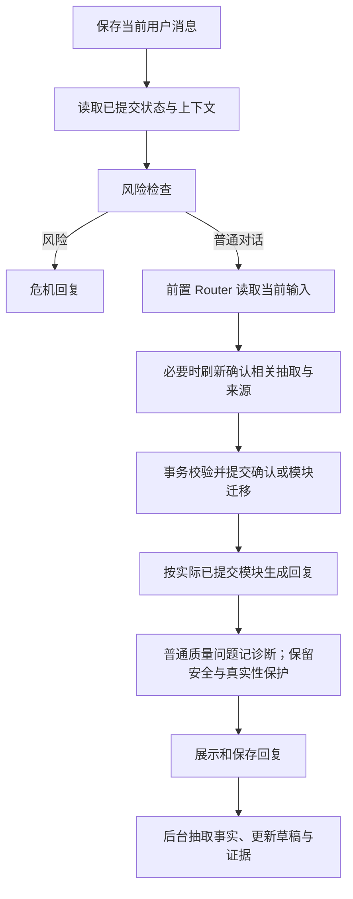

# 2026-09-24 手册本地实施记录

依据：`BA_Coach_系统操作手册_20260924_原版排版修订.pdf` 的有效正文，以及根目录 `0924提示词.docx`。PDF 修订边栏中的删除内容不作为有效要求。

基线：`853dfcd2bc352c082f7d56f47919fb4569e5b78d`；本地分支：`codex/manual-0924-alignment`。

本次修改保存在上述本地分支，范围为代码与默认 Prompt；未修改生产环境、线上管理员 Prompt 或实际业务数据库，未推送远端。

## 用户已确定的口径

| 问题 | 确定结果 |
| --- | --- |
| 最新卡片与历史版本 | 后台保留版本、状态和历史；界面默认最新卡片。 |
| 用户拒绝记录后解释几次 | 解释节奏由 M3 Prompt 结合顾虑处理；不设置代码次数门槛，最终不愿意时不强求。 |
| Router 前置后的正式确认 | 确认与正式迁移先提交成功，再使用实际模块生成回复。 |
| M2 具体规则来源 | 根目录 `0924提示词.docx`，包含 trial / secondary。 |
| 未执行时在 M3 改目标 | 允许 M3→M2；建立新草稿，保留旧计划、周期与记录。 |
| 最近三轮目标卡与数据库 | 能验证当前用户、会话、周期与确认版本时，以数据库为准；无法核验则阻止进入执行/复盘，不能拿任意旧卡替代。 |
| 等待执行时更改记录安排 | 允许在同一聊天更新，保留旧版本；历史同意或同安排重申不能重复创建新版本。 |
| 提醒承诺的条件 | 只有启用提醒、设备允许通知且执行时间可确定时，才说明预计 PA 结束约一小时后提醒；未核实条件时不承诺自动提醒。 |
| 未商定记录安排就先执行，复盘后继续 | 保留已确认计划并建立下一周期；已有有效记录安排时进入 M3 等待执行，缺少安排时进入 M3 补充安排。 |

## 当前调用关系

后台不再调用第二次模块 Router，不再把当轮助手说了什么直接作为迁移命令。前置 Router 的建议也不能直接改变业务状态；事务拒绝或失败时使用数据库实际模块。

`routing_pending` 保留为内部后台任务兼容标记；对外的模块决定在本轮回复前已经产生，API 不再显示“等待后台路由”。

## 主要实现

- `prompts.py` 与 `prompt_defaults/`：一次全局 Prompt、一次当前模块 Prompt，加必要事实、记忆与中介建议；移除服务器模块 Checklist、完整 Runtime Contract、微步骤补问清单和末尾重复管理员 Prompt。默认内容来自新 Word；按用户已确认口径修正其冲突部分。
- `pre_reply_routing.py`、`turn_confirmation.py`：前置路由、当前用户来源、确认提交及刷新后的临床上下文。Router 输出增加可选 `knowledge_task`，作为按需取数的接口字段；兼容旧单模块编号，不创建新的干预步骤。
- `dialogue_confirmation.py`、`program_confirmation.py`：用户确认与展示版本绑定；正式写入使用事务与保存点，失败不得留下部分确认。迟到抽取、其他用户、旧周期、更新后的用户消息不能授权本轮迁移。
- 同周期跨聊天：进入 M4 时同步同用户、同周期的其他聊天状态并保留各自记忆；M3 返回 M2 修改计划时复制已知计划补充信息，旧版本保留。
- `answer_validator.py`：普通质量问题保留原回复并记诊断；删除固定 coaching 兜底问题。无法核实的保存宣称、安全与技术异常仍受保护，必要时显示简短技术通知；目标卡渲染属于展示实际草稿，不是通用 coaching 替换。
- M1：三项核心教育可跨轮覆盖，同段内容可支持多项；缓解方法与可选教育不阻断完成。保留真实来源、理解、目标意愿及低披露路径，不按特定关键词或独立 quote 数量考核。
- M2：地点、时长、频率按需填写；用户真实 0–10 难度评分及来源进入契约，最终评分不高于 5。计划实质变化不能沿用旧评分。trial / secondary 保存为来源可核对的活动与上下文，不自动创建或升级核心目标；升级需用户明确选择。
- M3：新增 `recording_status` 与证据；接受/最终拒绝均可完成记录安排并留在 `M3 waiting_execution`，无需第二张确认卡。保留拒绝的具体对象，拒绝活动表不自动取消每日总结，拒绝 PA 不等于拒绝记录。等待期变更安排使用新版本。
- M4：实际完成与情绪改善分开；未提供实际时长时保留未知，不强行要求一个数字。继续原计划创建下一周期并回到 M3：已有有效记录安排进入 `waiting_execution`，缺少安排则进入 `active` 补充安排；调整计划回 M2，旧版本保留。
- 中介：`decision/selections/note`，0–2 条来源原文与用法便签；只读取任务相关字段。字段未提供不等于用户没说；已拒绝记录且无新问题不循环说服。历史提醒布尔值不冒充浏览器订阅授权。
- 每日总结：允许零活动行，保留整体三项；填写了部分活动内容时仍检查完整性。
- Web Push：已知预计结束约一小时后提醒，保留实际设备授权、同事件已反馈抑制和过期订阅保护。
- 诊断：保存 Prompt 来源版本、实际主模型输入、原始/替换回复、前置 Router、抽取和数据库写入结果，以及实际观测到的耗时。SSE 首段正文时间是服务端释放时间，不冒充浏览器绘制时间；历史缺失数据显示未记录。

## 数据迁移与发布边界

新增迁移脚本：

- `backend/scripts/migrate_m2_manual_0924.py`：难度与来源字段，调整旧目标方向约束。
- `backend/scripts/migrate_m3_recording_0924.py`：记录决定与来源字段。

脚本默认不修改数据库。旧已确认记录保留；缺少新语义证据的旧字段不伪造为已同意。本次正式业务状态使用 `DATABASE_SCHEMA_VERSION=v2`。已有数据库需要在运行新版代码前执行相应迁移；生产目标、备份和上线属于后续发布工作。

管理员已保存的 Prompt 仍优先于默认文件。新默认文件不会静默覆盖数据库中的管理员自定义 Prompt；验证或发布时须核对管理页面实际生效版本。

## 验证

使用本地 Python 3.12 虚拟环境和临时 SQLite 数据库；没有调用生产模型或生产业务数据。

测试覆盖前置顺序、真实当前用户确认、提交失败回滚、迟到抽取、并发新消息、M3 回改保留历史、等待期记录意愿变化、评分来源/版本、按需中介取数、每日记录与推送、HTTP/SSE、管理员 Prompt 与诊断组件。

旧仓库的 `retrieval_intent_cases.json` 曾随评测报告一起删除，导致测试无法收集；本次从 `7582109` 的父版本恢复原始测试用例到 `backend/tests/fixtures/`，没有恢复生成报告。

2026-09-25 全套后端回归：98 个测试文件，按文件隔离进程执行，**1,619 项通过、2 项跳过，0 失败、0 错误**。跳过项分别是未提供用户专用工作簿的可选评测，以及未安装 `qdrant_client` 的向量检索模块；后者因整个模块跳过产生 pytest 退出码 5，不代表测试失败。

前端 `tsc --noEmit`、Workbench 诊断组件测试与推送 Worker 测试通过。`git diff --check` 通过。未运行真实浏览器交互验收。

全套回归后补齐首段可见回复的计量口径持久化；HTTP/会话相关 65 项测试再次通过。

终审修复同周期跨聊天进入 M4 的状态同步，以及 M3→M2 新草稿的补充信息复制；新增 2 项真实数据库回归，受影响的 4 个测试文件共 43 项通过。这些复测与全套统计有重叠，不重复累加。

## 最后两项口径的落实

用户已确认按上述建议执行。M3 的两处提醒表述已加上启用与时间条件；M3、M4、Router 默认 Prompt 同步区分继续原计划后的两种记录安排状态。原 Word 文件作为输入材料保留，未改写。

继续周期时不伪造记录安排、不强迫重新确认原计划；没有有效安排则保留计划并在下一周期的 M3 补充。已有有效确认安排沿用，历史计划和记录保留。

新周期补充记录安排时使用新周期的消息来源边界：M4 提交日志记录 `next_cycle_id`，M3 核对创建该周期的真实 M2/M4 用户确认消息。旧周期未确认的草稿保留为历史，不直接成为新周期的确认依据。

最终继续周期、记录来源、M3/M4 确认与回滚相关的 11 个测试文件共 **155 项通过**。覆盖缺少安排、未确认安排、错误目标/计划、缺少来源、助手或其他用户来源、旧决定重放、新周期安排确认、历史版本保留及数据库失败回滚。已确认的历史安排按原迁移兼容政策保留，不因新增字段默认 `unknown` 撤销旧确认。

全部代码完成后，管理员 Prompt、前置 Router、回复边界和提醒相关的另外 4 个测试文件 **99 项通过**。两组文件不重叠，本轮针对最后两项口径共 **254 项测试通过**；不与前述全套或较早复测重复累加。`git diff --check` 通过。

## 尚未实测的边界

- 真实模型的多轮自然度、重复提问频率与等待时间，仍需固定模型/知识配置进行对话回放和干预侧验收。
- MySQL 并发保护按其事务语义实现；本次数据库回归运行于临时 SQLite，未冒充 MySQL 实库验收。
- 未连接真实推送设备或生产环境验证投递。
