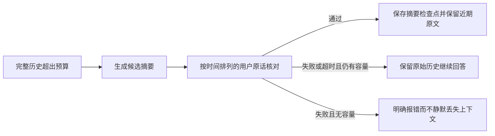

# BA Coach：借鉴 AstrBot 的上下文与知识库改造报告

日期：2026-10-02。状态：实现、回归和真实模型测试已完成；本文首次展示时尚未部署，部署结果将在文末追加。

## 结论

值得借鉴的是上下文职责分离、完整轮次压缩、知识切片保留标题层级，以及工具重复调用保护。没有必要把 BA Coach 整体换成 AstrBot，也没有证据表明换成其摘要提示词就能修复记忆错误。

本次最关键的变化是：**摘要必须通过基于用户原话的核对，才允许替代旧历史；核对失败时保留原文。** 真实 K3 仍会生成错误摘要，但最终版本在两次长历史回放中都拦住了错误。该结果证明保护机制在这两个样本中有效，不代表摘要已经完全可靠。

## 1. Git 备份与线上功能保护

- 改造前的全部现有修改已提交为 `20667f0`，并推送到 `origin/codex/manual-0924-alignment`。
- 检查发现，生产版本 `20261001T135113Z` 的部分功能没有回到本地分支。本次先比对实际服务器代码，再合并到候选版本，避免部署覆盖线上功能。
- 保留普通用户的 `router_only + ack_deep + low`；管理员继续使用独立设置。
- 保留管理员分享详情、普通用户分享隐私边界、消息反馈、并行接话及中断回复保存。
- 未重置任何用户对话、目标或业务进度。

## 2. 借鉴与取舍

参考 AstrBot 固定提交 `9d4f523464644554e0e8e50fa2a65f146e320cd1`，按设计思路在本项目实现；没有整段移植 AGPL 源码。

| 方面 | AstrBot 的做法 | BA Coach 本次选择 |
|---|---|---|
| 历史压缩 | 独立压缩器；按完整轮次保留近期历史；保护当前输入 | 保留并完善独立压缩设置、完整轮次和持久摘要检查点 |
| 摘要可靠性 | 自由文本摘要；超限时还有截断兜底 | 增加用户原话核对；错误摘要不落地，不静默删掉历史 |
| 知识切片 | Markdown 分层处理 | 切片携带父级标题路径，避免检索到子段落却丢失适用范围 |
| 检索 | 稀疏/向量检索、融合及可选重排 | 保留现有目录检索、分类约束和中介，不为相同能力新加向量数据库 |
| 工具循环 | 连续重复调用检测与提示 | 参数规范化后检测重复；第三次相同调用不执行，要求生成最终说明 |
| 并发与持久化 | 会话锁、运行状态和部分输出保存 | 保留本项目现有会话锁、事务与并行输出持久化 |

源码依据：[上下文压缩器](https://github.com/astrbotdevs/astrbot/blob/9d4f523464644554e0e8e50fa2a65f146e320cd1/astrbot/core/agent/context/compressor.py)、[上下文管理器](https://github.com/astrbotdevs/astrbot/blob/9d4f523464644554e0e8e50fa2a65f146e320cd1/astrbot/core/agent/context/manager.py)、[Markdown 切片](https://github.com/astrbotdevs/astrbot/blob/9d4f523464644554e0e8e50fa2a65f146e320cd1/astrbot/core/knowledge_base/chunking/markdown.py)、[检索管理器](https://github.com/astrbotdevs/astrbot/blob/9d4f523464644554e0e8e50fa2a65f146e320cd1/astrbot/core/knowledge_base/retrieval/manager.py)、[工具执行循环](https://github.com/astrbotdevs/astrbot/blob/9d4f523464644554e0e8e50fa2a65f146e320cd1/astrbot/core/agent/runners/tool_loop_agent_runner.py)。

## 3. 实际成品

### 3.1 稳定前缀与分段历史

主对话请求按“稳定规则和历史基线 → 已核对摘要及原始历史 → 本轮状态、检索和时间 → 当前输入”组织。每轮追加历史；达到阈值后才更新摘要检查点。当前检索内容不作为永久事实写进历史摘要。

默认历史预算为 24,000 个估算 token，压缩后保留近期约 8,000；压缩输入上限 48,000。这里使用 UTF-8 字节估算，并非供应商的精确 tokenizer。固定规则改变、摘要换段、模块变化以及供应商缓存有效期仍可能造成缓存重建。

这些缓存与检查点能力包含改造前已经写好的代码；本次将它们与线上并行模式整合后统一交付。

### 3.2 摘要核对与回退

核对关注否定、后来的纠正、事实与助手建议的区别，以及“想做、确认、已经执行”之间的边界。只接受 JSON 布尔值 `true`，不接受字符串 `"true"`、无效 JSON、截断或超时。

核对器读取按时间排列的用户原话和先前已核对摘要，排除助手反复复述的错误推断。旧摘要通过新的版本签名失效，不沿用未经本次机制核对的检查点。

摘要和核对分别记录供应商 request ID、耗时、usage 和结果，管理员请求记录中可查看上下文压缩事件。业务目标和计划的真实状态仍由数据库决定。

### 3.3 知识库标题层级

例如原文 `活动 → 准备 → 安全限制` 的子段落，现在携带完整路径。代码块中的 `#` 不会误判成标题；过长标题的索引字段限制在数据库允许长度内，正文保留完整路径。

新增受控重建脚本：只处理内容哈希仍与仓库原文一致的资料，跳过管理员修改过或来源未知的文档；更新前保存知识源和切片快照，在单个事务中替换。部署前核查：线上 10 份资料均与仓库原文一致，原索引共 1,331 个切片。

### 3.4 工具重复调用保护

同一工具与相同参数连续调用，第二次给出提示，第三次阻止执行并要求最终说明；保留总轮数和总耗时限制。不同 JSON 键顺序不会绕过检测。原有幂等和业务校验继续负责写入安全。

PA 原生工具仍受原有开关控制，默认关闭；本次没有为了展示这项保护而向普通用户开启实验功能。

## 4. 实测结果与失败记录

### 自动化验证

- 后端完整回归：**2,299 通过，2 跳过，0 失败**，约 81 秒。
- 跳过项：可选向量检索依赖测试、需额外提供原始工作簿的测试。
- 前端 TypeScript 检查与 Next.js 生产构建通过。
- 新增索引迁移保护测试通过：管理员修改的资料不被覆盖，备份不可覆盖且权限为 0600。
- 覆盖摘要拒绝/超时/旧检查点失效、标题层级、工具循环、普通用户有效模型参数、管理员分享和成员隐私、并行中断保存。
- 旧测试中与现行 M4“复盘结束后另行选择下一轮目标”冲突的断言已更新；没有为迁就旧测试恢复过时流程。

### 真实 K3 摘要测试

使用生产供应商配置，但在隔离内存数据库中运行，不修改真实用户对话。长历史样本为此前分享对话的 124 条消息；人为降低到 6,000/2,000 的压缩阈值以触发压缩。调用主模型检查回答，**不是完整网页端 Router＋并行回复链路的端到端测试**。

| 测试 | 结果 |
|---|---|
| 错误候选“用户原有每天跑步习惯” | 拒绝 |
| 忠实保留“有意愿但没跑过”的候选 | 通过 |
| 最终版本长历史回放第 1 次 | 候选被拒绝，保留原文；回答正确区分意愿与实际执行 |
| 最终版本长历史回放第 2 次 | 候选被拒绝，保留原文；回答正确区分意愿与实际执行 |

**失败过程没有隐藏：** 第一版核对器读取了完整对话，仍被助手多次出现的错误说法影响，两次漏判。改为用户原话核对后，反测此前两份错误摘要均被拒绝；最终重新生成的两份错误摘要也均被拒绝。

因此，本次证明的是“错误摘要在这些样本上被拦截”，不是“压缩模型已经总能生成正确摘要”。更高思考度本身不能作为事实正确的保证。

### 真实 K3 缓存测试

8 轮连续追加消息，每轮更改本轮检索与时间，保留稳定历史。结果：

- 总输入 24,574 token，其中缓存读取 19,200 token，**整体命中率 78.13%**。
- 排除首轮冷缓存后的 7 轮：**88.08%**。
- 第 8 轮：3,072 / 3,359，约 **91.46%**。

这是隔离的提示词排列测试，不是全站统计；不能据此宣布生产已稳定达到 90%。它支持“追加历史仍能复用前缀”，但实际平均值还受首轮、短对话、切换模块、压缩换段及动态后缀占比影响。必须按实际 `cache_read_input_tokens / input_tokens` 统计；缺失遥测不能当作零。

## 5. 成本与剩余限制

1. 每次压缩新增一次模型核对调用，增加费用与延迟。最终两次长历史样本中，摘要约 21/25 秒，核对约 9/16 秒；这不是每轮都发生。
2. 错误摘要被拒绝后，继续携带原文会减少当次压缩收益；若后续持续超阈值，可能重复尝试。当前优先保证不以错误记忆换取便宜 token。
3. 超长历史既不能安全压缩又超出输入余量时，会明确失败；原始记录仍保存，后续可改用人工摘要或经过评估的其他压缩模型。
4. 核对仍由模型完成，可能漏判；两次回放不是统计意义上的准确率保证。用户简短回应与前文指代也需要更多样本评估。
5. 未新增自动跨会话“个人记忆库”，未引入新向量数据库。共享知识库、业务事实、对话摘要继续分开，避免把推断永久写成个人事实。
6. 本次没有证明“偶尔突然提到跳绳”等所有话题偏移都已解决；摘要与主模型直接推断仍需分别追踪。

## 6. 发布与回退方案

先展示本文，再按本次指令部署。候选版本包含上述改造及与线上功能的合并。发布时保留旧目录 `20261001T135113Z`，构建和启动失败自动切回；不删除旧版本作为回退保障。

知识库单独受控重建并保存原始快照。V2 生产环境禁用自动建表，新增的上下文检查点表在切换版本前通过专用增量脚本创建；不改写用户原始对话。线上 M4 数据库约束已符合当前流程，不需再次迁移。

发布后核查服务健康、外部页面、普通用户有效路由与思考策略、管理员 Prompt 覆盖哈希、知识源数量和重建结果。生产实测与最终提交号追加如下。

## 7. 发布结果

尚未部署，待展示报告后执行。
