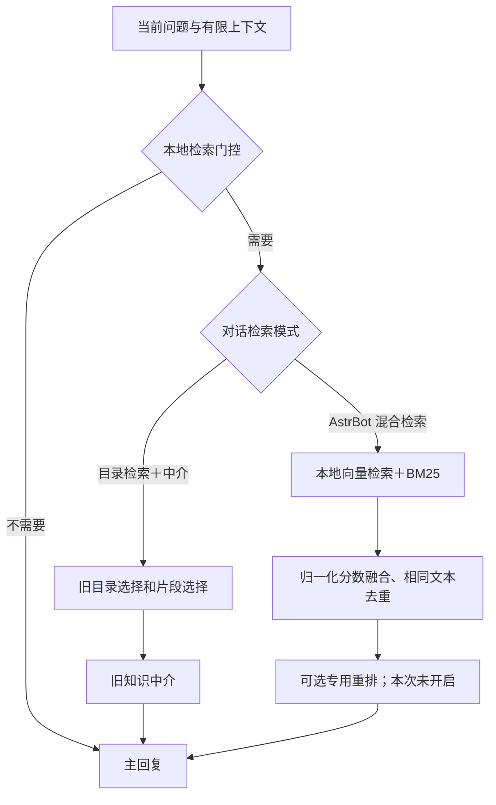

# BA Coach 两种知识检索模式：实现与验证报告

日期：2026-10-02。代码提交：`2a0abd2`；改动前快照：`577ce94`。两者已推送到 `codex/manual-0924-alignment`。

## 结果与适用范围

管理员对话新增“知识检索模式”选择：**目录检索＋中介**、**AstrBot 混合检索**。原来开启中介的对话继续使用旧模式；原来关闭中介的管理员对话改为混合检索。下一轮生效，正在生成回复时不能切换。

两条路径互斥。混合检索不会再调用旧目录选择、旧片段选择或中介模型，也不会在失败时偷偷切回旧模式。普通用户没有新开关，默认路径保持原样；成员不能通过请求字段或曾经的管理员设置开启实验路径。

速度改善已实测，但**不能据此宣称检索质量全面优于旧模式**。一次原则性问题中旧模式找到了更直接的原文，新模式的排序仍偏宽泛。因此保留默认旧模式，让管理员按对话对比使用。

## 两条实际执行路径

新模式还保留模块与知识类别限制、用户明确拒绝当前记录安排的处理、安全上下文不可用时不注入材料等现有边界。知识资料仍是参考材料，不是用户事实。

## 借鉴 AstrBot 的部分

参考 AstrBot 提交 `9d4f523464644554e0e8e50fa2a65f146e320cd1` 的检索分层设计，独立实现适配代码；没有引入整个 AstrBot 运行时，也没有复制其源码。

| 环节 | 当前实现 |
| --- | --- |
| 稠密检索 | FastEmbed / ONNX 本地 CPU 嵌入，FAISS `IndexFlatIP` 查询 |
| 嵌入模型 | `sentence-transformers/paraphrase-multilingual-MiniLM-L12-v2`，384 维；长片段按 token 窗口编码后归一化平均 |
| 稀疏检索 | Jieba 分词＋BM25，加入停用词、已拒绝活动处理与原有中英术语映射 |
| 融合 | 向量分数整体归一化；BM25 按 BA/PA/BCT/MI 类别分别归一化；默认向量权重 0.9 |
| 同分与去重 | RRF 只用于同分排序；完全相同文本去重，允许同一文档的不同片段保留 |
| 重排 | 支持可选专用 rerank API；本次未配置、未调用。重排失败保留融合结果并记录状态 |
| 项目适配 | 沿用 MySQL 权威语料、真实片段 ID、类别权限、每轮来源快照；新增低词项覆盖过滤 |

所以“采用 AstrBot 检索架构”指上述完整检索流程，**不代表已经迁入 AstrBot 的文档管理、SQLite FTS 存储、聊天记忆、插件系统或全部管理界面**。BM25 使用独立 Python 实现，存储继续适配本项目 MySQL。

参考：[AstrBot 检索管理器](https://github.com/astrbotdevs/astrbot/blob/9d4f523464644554e0e8e50fa2a65f146e320cd1/astrbot/core/knowledge_base/retrieval/manager.py)、[分数融合](https://github.com/astrbotdevs/astrbot/blob/9d4f523464644554e0e8e50fa2a65f146e320cd1/astrbot/core/knowledge_base/retrieval/rank_fusion.py)、[FastEmbed 官方说明](https://qdrant.github.io/fastembed/)。

## 索引与失败处理

- 两种模式读取同一份线上知识库：本次为 1,331 个片段。
- 向量按模型资产、编码版本、片段内容寻址，原子写入本地衍生缓存；重启可复用，改变内容只需编码变化的片段。
- 每轮检索继续检查数据库知识修订号；更新、删除或检索期间发生修改，都不能返回过时片段。
- 首次完整编码在上线准备阶段完成，线上请求不会下载模型。服务器首次完整构建实测约 192 秒；这不属于正常查询耗时。
- 更新后索引尚未准备好时，后台构建，本轮明确记录 `withheld_index_building`。查询计算超时上限默认 3 秒；错误时不注入知识，不回退到旧目录模型。
- 本地嵌入不产生嵌入 API 费用。新模式知识阶段的目录与中介聊天模型调用数为零；风险检查、Router 和主回复仍照常运行。
- 调试详情记录实际检索模式、索引身份、模型、融合方式、重排状态、召回片段和实际提供给回复的片段。

## 线上同题对照

同一线上语料，未使用检索结果缓存；旧路径使用真实 K3 目录检索与中介，新路径使用本地嵌入。目录模型关闭深度思考。下表均为**知识处理阶段**，不含整条回复；单次小样本，不是生产 P95 或准确率评估。

| 测试问题 | 旧目录＋中介 | 新混合检索 | 观察 |
| --- | ---: | ---: | --- |
| 为什么不能等心情好了再行动 | 18.197 秒 | 0.120 秒 | 旧模式直接召回“由外而内”；新模式前四项偏向相关案例，原理定位较弱 |
| 散步十分钟算身体活动吗 | 15.361 秒 | 0.094 秒 | 两者均有散步资料；新模式还召回较宽泛的活动安排资料 |
| 知道应该行动但没有动力 | 18.180 秒 | 0.091 秒 | 旧模式更聚焦分级任务；新模式偏向动机和计划资料 |
| 学习后又去游戏的循环 | 16.318 秒 | 0.089 秒 | 旧中介本次输出不符合结构；新模式提供了相关案例和行为模型 |
| 不想跳绳，只想散步 | 12.077 秒 | 0.086 秒 | 旧目录本次失败未返回；新模式召回散步与计划资料 |
| 英文询问行为激活 | 15.517 秒 | 0.085 秒 | 旧中介本次输出不符合结构；新模式能跨语言找到相关中文资料 |
| 量子计算机价格 | 3.962 秒 | 0.088 秒 | 两者均未提供知识片段 |
| 你好 | 跳过 | 跳过 | 门控生效，无检索 |

七条实际检索的中位数：旧模式 **15.517 秒**，新模式 **0.089 秒**。不能把“返回片段”当作“回答准确”，也不能把这个比例直接换算成主对话总体加速比例。

另外用当前线上有效系统提示词运行了一次真实 K3 图流程：输入明确说“不想跳绳，只想晚饭后散步十分钟”。整轮约 **10.646 秒**，知识阶段约 **0.312 秒**；回复围绕散步继续询问难度，没有改推跳绳。调试记录确认 `astrbot_hybrid`、`hybrid_direct`、目录调用 0、中介调用 0。该检查没有写入生产用户或业务记录。

## 验证与发布

- 相关后端回归 **420 项通过**：聊天、会话、权限、知识、缓存、分享以及新增混合检索测试。
- 本地和服务器前端生产构建通过。
- 浏览器验证通过：切换保存、刷新保持、对话隔离、切回旧模式、手机宽度适配、普通用户不显示开关。
- 新增依赖安装在独立环境 `/opt/bacoach/venvs/hybrid-20261002`；原环境不变。
- 本次没有数据库迁移、知识库导入或旧数据改写。
- 候选版本：`/opt/bacoach/releases/20261002T134800Z`；回滚版本：`/opt/bacoach/releases/20261002T125821Z`。
- 已于 **2026-10-02 21:58（北京时间）** 完成生产切换，发布脚本退出码为 0。
- 运行目录已确认指向候选版本；新后端进程日志确认 `1331 indexed chunk(s)` 和启动完成，未出现索引预热错误。
- 外网页面返回 200，实际下载的前端 bundle 包含两个新模式的界面文案；未登录访问 `/api/auth/me` 返回预期的 401。
- 后端和前端服务均运行；部署保留原有通知工作进程的启停策略。
- 切换后服务器可用内存约 1.2 GiB。新环境与旧环境隔离，回滚版本仍保留。

完整测试证据保存在本地 `诊断导出/混合检索-20261002/` 的 `comparison.json`、`reply.json` 和界面截图。报告中的质量判断是本次样例检查，不是盲测或临床效果验证。
